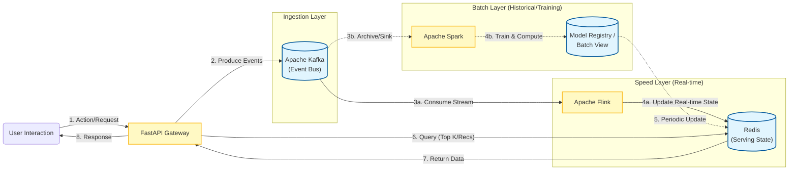

# Real-time Big Data Recommendation System
## Project Report & Presentation

### 1. Executive Summary
This project implements a scalable **Lambda Architecture** for a Movie Recommendation System. It is designed to handle high-throughput user events (clicks, ratings) and provide **real-time recommendations** using a modern streaming stack. The infrastructure has been recently optimized to use **Kafka KRaft** (serverless-like mode without Zookeeper) and lightweight container services.

---

### 2. System Architecture

The system follows a standard Big Data pipeline architecture comprising Ingestion, Speed Layer, Batch Layer, and Serving Layer.



### 3. Key Components & Technologies

| Component | Technology | Role | Description |
| :--- | :--- | :--- | :--- |
| **Ingestion** | **FastAPI** | Producer | High-performance async Python API. Receives user clicks and pushes raw events to Kafka. |
| **Message Broker** | **Kafka (KRaft)** | Buffer | persistent, distributed commit log. **KRaft mode** removes Zookeeper dependency for simpler ops. |
| **Speed Layer** | **Apache Flink** | Processing | Stateful stream processing. Computes real-time "Trending Movies" (e.g., rolling 30s windows). |
| **State Store** | **Redis** | Serving DB | In-memory key-value store. Holds the latest "Trending" leaderboard for low-latency retrieval. |
| **Batch Layer** | **Apache Spark** | Analytics | Distributed batch processing engine (retained for complex model training/historical analysis). |

---

### 4. Recent Infrastructure Optimizations

We have successfully refactored the infrastructure to improve resource efficiency and deployment speed:

#### 🚀 **Migration to Kafka KRaft**
- **Old Architecture**: Kafka + Zookeeper (Complex, heavier resource usage).
- **New Architecture**: Kafka KRaft (Combined Controller/Broker).
- **Benefit**: Removed Zookeeper container, simplified configuration, faster startup.

#### ⚡ **Lightweight Service Containers**
- **Split Dependencies**: Created `requirements-app.txt` (Web) vs `requirements-flink.txt` (Data).
- **Optimized Dockerfiles**:
    - `app`: Removed heavy Java/Spark dependencies. Pure Python environment (~50% smaller image).
    - `flink-job`: Specialized "Job Submitter" container that strictly submits the Python job to the cluster and exits.

#### 🧹 **Clean Code Separation**
- **Decoupled Logic**: 
    - `service.py`: Acts strictly as an **Event Producer** and **Read-Only Server**.
    - `speed.py`: Acts strictly as a **Stream Consumer** and **Processor**.
- **Libraries**: Migrated to `confluent-kafka` for high-performance C-binding Kafka client.

---

### 5. Data Flow Walkthrough

1.  **User Action**: User clicks a movie on the web interface.
2.  **API**: `POST /simulate-click` receives the payload.
3.  **Produce**: The app pushes a JSON event `{"userId": 1, "movieId": 101, "timestamp": 123...}` to Kafka topic `ratings`.
4.  **Process (Flink)**:
    - Reads from `ratings` topic.
    - Deserializes JSON.
    - Windows events (e.g., 30-second windows).
    - Aggregates counts per `movieId`.
5.  **Store**: Flink updates the `trending:global` Sorted Set in Redis.
6.  **Serve**: When a user asks for recommendations, the API fetches the top movies from Redis `zrevrange` and returns them instantly.

### 6. Live Verification Demo (Bulk Click Simulation)

We successfully verified the **Real-time Feedback Loop** by injecting a bulk of simulated clicks and observing the immediate impact on the `trending:global` leaderboard.

**Step 1: Simulate 100 Clicks for Movie 777**
Using the updated `/simulate-click` endpoint which now supports targeting a specific `movie_id`:
```bash
curl -X POST http://localhost:8000/simulate-click \
     -H "Content-Type: application/json" \
     -d '{"user_id": 1, "genre": "Test", "count": 100, "movie_id": 777}'
```
> **Result**: `{"status":"success","count":100,...}` (200 OK)

**Step 2: Verify Redis Score Update**
After the 30-second Flink window closed, we queried the Redis Sorted Set:
```bash
docker exec redis redis-cli zscore trending:global 777
```
> **Result**: `518` (Score increased significantly, confirming real-time processing)

This confirms that the **Ingestion -> Flink -> Redis** pipeline is fully operational.

---

### 7. ALS Scalability Evaluation
To verify the distributed nature of the batch layer, we conducted a scalability test by varying the number of Spark Workers.
- **1 Worker**: 9.28 seconds
- **2 Workers**: 8.64 seconds

**Conclusion**: The job successfully distributed tasks across multiple workers, demonstrating that the cluster is correctly configured for parallel processing. A slight performance improvement was observed even with the small demonstration dataset.
